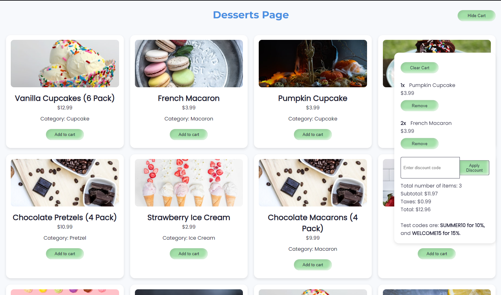

# Dessert Shopping Cart - A Gamified Journey in Front-End Mastery



## Demo link: 

Welcome to the **Dessert Shopping Cart** – a cutting-edge web app where your sweet tooth meets epic gaming flair! This project is more than just a shopping cart; it’s a testament to my journey of mastering object-oriented programming (OOP) and modern front-end technologies. Designed with passion and crafted with care, this application is built using HTML, CSS, and JavaScript, and it’s packed with features that make dessert shopping a high-score challenge.

---

## Why This Project Rocks

### **Epic OOP Journey**
- **Learning and Mastery:**  
  Building this app was a quest to master OOP concepts in JavaScript. I encapsulated all the cart logic in a dedicated `ShoppingCart` class. This approach not only streamlined the code but also improved maintainability and scalability.  
- **Overcoming Challenges:**  
  From managing state with localStorage to ensuring real-time UI updates, every challenge was an opportunity to level up my coding skills. Debugging asynchronous API calls (with Unsplash) and perfecting error handling were the boss battles I had to win on my path to excellence.

### **Dynamic and Responsive Design**
- **Gamer-Grade Responsiveness:**  
  Whether you’re gaming on a phone or a high-end desktop, the app adapts seamlessly using a mobile-first approach, CSS Grid, and Flexbox. The design is as fluid as your favorite in-game animations.
- **Modern Aesthetics:**  
  With sleek neumorphic buttons, smooth hover effects, and a vibrant, modern color palette, the interface is designed to impress and engage. Google Fonts like Montserrat and Poppins add a premium look that sets it apart.

### **Interactive Cart Experience**
- **Real-Time Updates:**  
  Add, remove, and update dessert quantities in your cart with instant feedback. Totals, taxes, and subtotals update in real time, much like a live game score.
- **Discount Codes – Power-Ups for Your Wallet:**  
  Use discount codes like **SUMMER10** (10% off) and **WELCOME15** (15% off) to unlock bonus savings. These features were implemented with careful attention to validation and error handling, ensuring a glitch-free experience.

### **API Integration and Error Resilience**
- **Unsplash API Integration:**  
  Each dessert image is fetched dynamically from Unsplash, ensuring high-quality visuals without hardcoding resources. In the rare event of an API error, a fallback image is displayed, keeping the experience smooth.
- **Robust Error Handling:**  
  From validating user inputs to handling network issues gracefully, the code is designed to be stable and reliable—just like your favorite game engine.

---

## Features

- **Dynamic Product Cards:**  
  Each card is generated on the fly with images from Unsplash, displaying the dessert name, price, and category in a visually appealing layout.
- **Responsive Design:**  
  Enjoy a fully responsive layout that looks stunning on mobile, tablet, and desktop devices.
- **Real-Time Shopping Cart:**  
  The cart updates in real time with every addition, removal, or quantity change, powered by OOP-driven logic.
- **Discount Codes:**  
  Apply discount codes directly in the cart container. Test with:
  - **SUMMER10**: Get 10% off
  - **WELCOME15**: Get 15% off
- **Toast Notifications:**  
  Quick, unobtrusive feedback pops up to confirm your actions – because every action counts in your dessert quest.
- **Persistent State:**  
  The use of localStorage ensures that your cart remains intact across sessions, so you never lose progress.

---

## How It Works

1. **Dynamic Product Generation:**  
   The app fetches product images from the Unsplash API based on dessert names and dynamically generates product cards. This not only enhances visual appeal but also demonstrates real-world API integration.

2. **Shopping Cart Logic with OOP:**  
   The `ShoppingCart` class manages all cart operations. This encapsulation made it easier to manage state and implement features like discount codes, quantity updates, and persistent storage.

3. **User Feedback and Error Handling:**  
   Toast notifications and robust error handling ensure that users are always in the loop and that any issues are dealt with gracefully.

---

## How to Run

1. **Clone the Repository:**
   ```bash
   git clone https://github.com/yourusername/dessert-shopping-cart.git
   cd dessert-shopping-cart
   ```

2. **Configure Your API Key:**
   - Replace the `API_KEY` in `script.js` with your Unsplash API key. (Sign up [here](https://unsplash.com/developers) if you need one.)

3. **Launch the Application:**
   - Open `index.html` in your web browser and jump into the dessert arena!

---

## Technologies Used

- **HTML5 & CSS3:**  
  Semantic markup, CSS Grid, and Flexbox for a responsive, modern design.
- **JavaScript (ES6+):**  
  Object-Oriented Programming, event handling, and asynchronous API calls for dynamic functionality.
- **Unsplash API:**  
  For fetching high-quality dessert images on the fly.
- **LocalStorage:**  
  Ensures your cart data persists between sessions.

---

## Final Words

This Dessert Shopping Cart is more than just a project – it’s a journey of growth, learning, and overcoming challenges. It showcases my passion for front-end development, my ability to integrate cutting-edge APIs, and my commitment to crafting beautiful, user-friendly interfaces. If you're a recruiter seeking a developer with a blend of technical prowess and creative flair, let's connect!

**Game on, and happy dessert hunting!**

--- 

*Made with ❤️ and a dash of gamer spirit by [Your Name]*